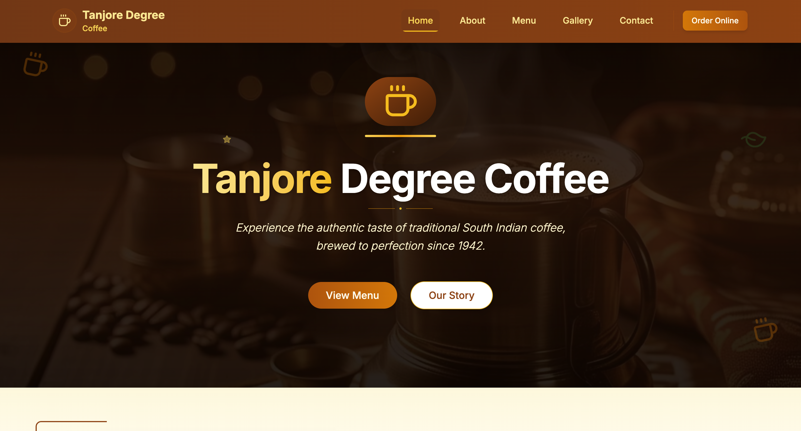
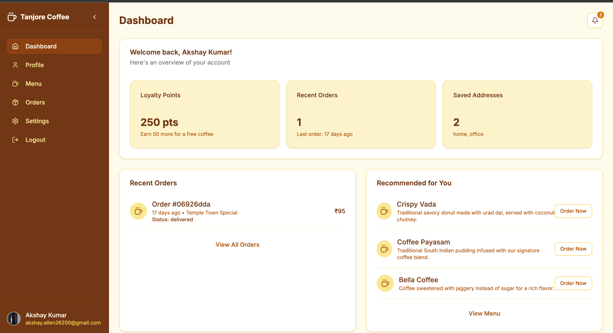

# Tanjore Degree Coffee ☕

*A modern e-commerce platform for authentic South Indian coffee and snacks, brewed to perfection since 1942.* 🌟 

## Overview 📖

Tanjore Degree Coffee is a Next.js-based web application that brings the authentic taste of traditional South Indian coffee to your doorstep. With a rich history dating back to 1942, this platform offers a seamless experience for browsing menus, managing orders, and enjoying a personalized dashboard for authenticated users. Built with TypeScript, Supabase for backend services, and a clean UI, Tanjore Degree Coffee combines tradition with modern technology. 🚀  

## Features ✨

- **Menu Browsing**: Explore coffee specialties, traditional brews, and snacks via the menu page. 🍵
- **User Authentication**: Secure login to access personalized features like the dashboard. 🔒
- **Dashboard**: View loyalty points, recent orders, saved addresses, and favorite coffees after logging in. 📊
- **Order Online**: Place orders directly from the homepage with a streamlined checkout process. 🛒
- **Responsive Design**: Optimized for both desktop and mobile devices. 📱💻
- **WhatsApp Support**: Integrated support link for customer assistance. 📞
- **Emails**: Resend is used for emails. ✉️ 

## User Flow 👤

1. **Homepage**: Start on the homepage, where you can explore the "View Menu" or "Our Story" sections. 🌐
2. **Order Online**: Click the "Order Online" button in the top-right corner to begin your ordering journey. 🛒
3. **Login**: You'll be prompted to log in to proceed with your order. 🔑
4. **Dashboard**: Upon successful login, you're redirected to a personalized dashboard showing:
   - Recent orders 📦 
5. **Menu & Ordering**: Navigate to the menu to browse items, add them to your cart, and complete your order. 🍽️

## Tech Stack 🛠️

- **Framework**: [Next.js](https://nextjs.org/) (React framework with server-side rendering) ⚛️
- **Language**: [TypeScript](https://www.typescriptlang.org/) 📜
- **Database/Auth**: [Supabase](https://supabase.com/) (PostgreSQL-based backend-as-a-service) 🗄️
- **Styling**: Tailwind CSS via custom `globals.css` and PostCSS 🎨
- **UI Components**: Shadcn components (e.g., Button, Card, Dialog) 🧩
- **Icons**: [Lucide React](https://lucide.dev/) 🖼️
- **Linting**: ESLint with TypeScript support ✅

## Getting Started 🚀

### Prerequisites ✅

- [Node.js](https://nodejs.org/) (v18 or later) 🟢
- [npm](https://npm.io/) (or npm/yarn) 📦
- [Supabase Account](https://supabase.com/) with a project set up 🗄️

### Installation ⚙️

1. **Clone the Repository** 📥
   ```bash
   git clone https://github.com/akshay0611/tanjore-degree-coffee.git
   cd tanjore-degree-coffee
   ```

2. **Install Dependencies** 📦
   ```bash
   npm install
   ```

3. **Set Up Environment Variables** 🔑
   Create a `.env.local` file in the root directory and add your Supabase credentials:
   ```
   NEXT_PUBLIC_SUPABASE_URL=your-supabase-url
   NEXT_PUBLIC_SUPABASE_ANON_KEY=your-supabase-anon-key
   ```

4. **Run the Development Server** ▶️
   ```bash
   npm dev
   ```
   Open [http://localhost:3000](http://localhost:3000) in your browser to see the app. 🌐

### Scripts 📜

- `npm dev`: Start the development server ▶️
- `npm build`: Build the production app 🏗️
- `npm start`: Start the production server 🚀
- `npm lint`: Run ESLint to check code quality ✅

## Screenshots 📸

### Homepage
 
*The homepage welcomes users with a call to "View Menu" or learn "Our Story," with an "Order Online" button to start the ordering process.*

### Dashboard

*The dashboard provides a personalized overview with recent orders, saved addresses and favorite coffees.*

## Contributing 🤝

Contributions are welcome! Please follow these steps:

1. Fork the repository. 🍴
2. Create a new branch (`git checkout -b feature/your-feature`). 🌿
3. Commit your changes (`git commit -m "Add your feature"`). 💾
4. Push to the branch (`git push origin feature/your-feature`). 📤
5. Open a pull request. 🙌

## License 📜

This project is licensed under the [MIT License](LICENSE). ✅ 

## Acknowledgments 🌟 

- Built with ❤️ by [Akshay](https://github.com/akshay0611) 
- Inspired by the rich tradition of South Indian coffee culture since 1942 ☕  